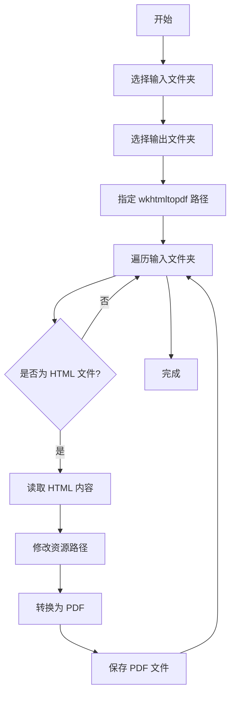

# HTML to PDF Converter

这是一个使用 Python 和 tkinter 构建的 GUI 应用程序，用于将 HTML 文件批量转换为 PDF 文件。

## 项目概述

HTML to PDF Converter 是一个简单而强大的工具，它可以：

1. 批量处理 HTML 文件
2. 保持原始 HTML 文件的样式和布局
3. 支持本地资源（如图片和 CSS）的加载
4. 提供用户友好的图形界面

## 工作原理

该应用程序的工作流程如下：

1. 用户选择包含 HTML 文件的输入文件夹
2. 用户选择 PDF 文件的输出文件夹
3. 用户指定 wkhtmltopdf 可执行文件的路径
4. 程序遍历输入文件夹中的所有子文件夹
5. 对每个子文件夹中的 HTML 文件进行处理：
   - 读取 HTML 内容
   - 修改资源路径为绝对路径
   - 使用 pdfkit 将 HTML 内容转换为 PDF
6. 生成的 PDF 文件保存在指定的输出文件夹中

## 可视化工作流程



## 依赖项

- Python 3.x
- tkinter
- pdfkit
- wkhtmltopdf

## 安装

1. 克隆此仓库：
   ```
   git clone https://github.com/yourusername/html-to-pdf-converter.git
   ```

2. 安装所需的 Python 包：
   ```
   pip install pdfkit
   ```

3. 安装 wkhtmltopdf：
   - Windows: 从 [wkhtmltopdf 官网](https://wkhtmltopdf.org/downloads.html) 下载并安装
   - macOS: 使用 Homebrew 安装 `brew install wkhtmltopdf`
   - Linux: 使用包管理器安装，如 `sudo apt-get install wkhtmltopdf`

## 使用方法

1. 运行 `html_to_pdf_converter.py`
2. 在 GUI 中选择输入文件夹、输出文件夹和 wkhtmltopdf 路径
3. 点击 "转换为 PDF" 按钮开始转换过程

## 注意事项

- 确保 HTML 文件中的所有资源（图片、CSS 等）都可以在本地访问
- 转换大量或复杂的 HTML 文件可能需要一些时间
- 如果遇到问题，请检查控制台输出以获取详细的错误信息

## 致谢

本项目的 HTML 文件来源于 [wechat-article-exporter](https://github.com/jooooock/wechat-article-exporter) 项目。感谢 [jooooock](https://github.com/jooooock) 提供的优质工具，使我们能够导出微信公众号文章。本项目旨在为这些导出的 HTML 文件提供一个便捷的 PDF 转换工具，进一步扩展了原项目的功能。

## 贡献

欢迎提交 Pull Requests 来改进这个项目。对于重大更改，请先��� issue 讨论您想要改变的内容。

## 许可证

[MIT License](LICENSE)
